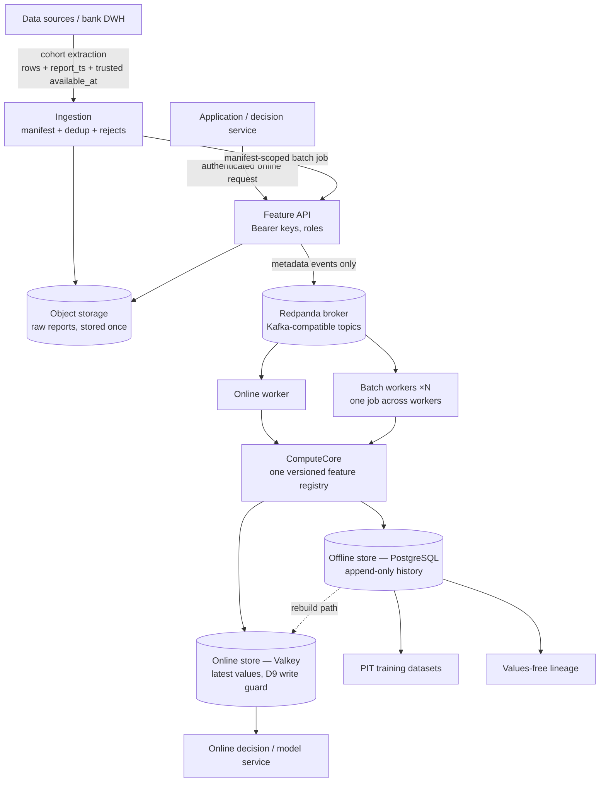

# Architecture One-Pager

Raw reports are stored once in object storage; the message broker carries only
metadata and references; one ComputeCore executes every feature definition for both
batch and online paths; results land in an append-only offline history (PostgreSQL)
and a latest-value online store (Valkey, a Redis-compatible store) behind a
deterministic write guard. The broker is **Redpanda** using the **Kafka-compatible
API** — meaning standard Kafka clients, topics and consumer groups talk to it; there
is no Apache Kafka container.

## The time contract (the platform's core discipline)

Every value carries up to four distinct clocks — never collapsed into one field:

| Clock | Meaning |
|---|---|
| `report_ts` | business/as-of time of the source fact (required) |
| `available_at` | when the fact became available to the bank — trusted only on operator ingestion; online requests are server-stamped with accept time and **cannot backdate** |
| `ingested_at` | when the platform accepted and persisted the fact |
| `calc_ts` | when the platform computed the feature value |

Training eligibility: `data_ts ≤ observation − safety_gap` **and**
`(available_at or calc_ts) ≤ observation` — trusted historical backfills become
historically usable; everything else stays conservatively excluded. Corrections to
trusted availability are recorded in an append-only audit table.

## Trust boundaries

Every HTTP hop authenticates (`Authorization: Bearer`, service/operator roles;
fail-closed startup); the demo decision service holds its **own** key registry and
presents its **own** key to the Feature API — the internal network is never a
credential. Kafka events carry no raw payloads (one documented exception: inline
batch jobs ≤ 1,000 items, an explicitly-labeled convenience path). Metrics, lineage
and statuses are values-free.

## Deployment status — read this precisely

**Validated today:** a single-node Docker Compose stack (PostgreSQL, Valkey, MinIO,
Redpanda, API + six workers + optional demo scorer) with health checks, persistent
volumes, additive migrations and one-command end-to-end smokes. This is a
demo/pilot/serious-development runtime — **not** high availability.

**Future production path (planned engineering, not implemented):** horizontally
scaled API/workers, external or highly-available PostgreSQL/Kafka/object
storage/online store, Kubernetes or equivalent orchestration, permanent
monitoring/alerting, restore and failover drills. The service contracts (env-driven
configuration, one-image-many-commands, health checks) are shaped for that
migration — see `../deployment/docker_compose.md` §8.

Technical depth: the architecture overview in this document (design), `../audit/` (verified
as-built state, endpoint policy, runbooks), `../security/minimum_security.md`.
